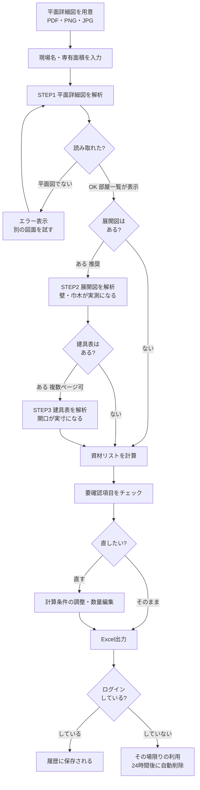

# ZAIRYO 資材拾いアシスタント ／ 製品仕様書

図面をアップロードすると、AIが読み取って資材の数量と概算金額を自動で算出します。
手作業で半日かかっていた資材拾いを、数分に短縮することを目的としたシステムです。

- **利用形態**: Webブラウザ（インストール不要・PC/タブレット対応）
- **対象図面**: 3種類（PDF / PNG / JPG、各10MBまで）
  1. **平面詳細図**（必須）… 間取り・床・天井を読み取ります
  2. **展開図**（任意）… 壁・巾木が「目測」から「実測」になります
  3. **建具表**（任意・複数ページ可）… 開口・建具が実寸になります
- **出力**: 資材リスト（画面表示・Excelダウンロード）

> 現在は新築マンション1棟の実測データと突き合わせながら、**壁・天井・床まわりの建材**を
> 完璧にする開発段階です。資材リストの表示も建材項目に絞っています（→ 9章 開発状況）。

---

## 1. できること

| できること | 内容 |
|---|---|
| 図面の自動読み取り | 部屋の面積・間取り・天井高・壁の仕上記号・建具を図面から読み取ります |
| 3図面の段階式解析 | 1枚ずつ解析し、平面図の読み取り結果（部屋一覧）を次の図面の解析に引き継ぐことで精度を高めます |
| 資材数量の自動計算 | 石膏ボード・グラスウール・キッチンパネルなどの建材数量を、プロの拾い出しと同じ方式で算出します |
| 概算金額の算出 | 登録済みの単価をかけ合わせ、合計金額の目安を表示します |
| 数量の手直し | AIの読み取りが不安なときは、画面上で数量や単価を直せます |
| 独自項目の追加 | 自動計算にない項目を見積に足せます |
| Excel出力 | 資材リストをExcelファイルでダウンロードできます |
| 過去の見積の保存 | ログインすると、現場ごとに見積を保存し、あとから見返せます |

### 現在表示している資材（建材14項目）

見積明細書と同じ「名称／摘要」の表記で表示します。

壁 石膏ボード / 壁 耐水石膏ボード / 一部界壁 石膏ボード / 一部界壁 耐水石膏ボード /
EV廻り壁 石膏ボード / マルチクロゼット・WIC・CLRC面 石膏ボード / 天井 石膏ボード /
下り天井 石膏ボード / 壁 キッチンパネル / 壁 キッチンパネル見切り / 間仕切 グラスウール充填 /
EV廻り壁 グラスウール充填 / カーテンレール・手摺・タオル掛 下地補強合板 / エアコン下地補強合板

※ 摘要の「(3'×6')」は3尺×6尺＝910×1820mmの板（サブロク判）を表します。

---

## 2. 使い方の流れ（段階式アップロード）

### STEP 1：平面詳細図を解析する（必須）

1. 現場名を入力します（例：○○マンション Aタイプ）
2. **専有面積がわかる場合は入力します**（任意ですが、入力すると精度が上がります）
3. 平面詳細図をドラッグ＆ドロップし、「解析する」を押します
4. 解析が終わると、読み取った間取り・部屋の一覧が表示されます

> **所要時間**: 30秒〜1分ほど。この時点で「資材リストを計算」に進むこともできます（従来方式）。

### STEP 2：展開図を解析する（任意・推奨）

展開図を選ぶと自動で解析が始まります。各部屋のA〜D面（4方向の壁）の幅×高さを読み取り、
壁の面積・巾木の長さが**実測値**に置き換わります。

- STEP 1で読み取った部屋一覧をAIに引き継ぐため、部屋名の対応づけが正確になります
- 大きな図面でつぶれがちな壁記号・建具は、**図面を分割拡大して読み直す**詳細パスが自動で走ります
- 読み取り結果（部屋数・開口数・壁記号）がその場で表示され、失敗したら別のページで読み直せます

### STEP 3：建具表を解析する（任意）

建具表を選ぶと自動で解析が始まり、ドア・窓の実寸が壁面積の開口控除に使われます。

- **複数ページに対応**：スチール建具・アルミ建具・木製建具でページが分かれていても、
  「次のページを追加」で順にアップロードすれば符号単位で合算されます

### STEP 4：資材リストを確認・手直しする

- 概算合計金額、壁面積・天井面積・床面積などの内訳が表示されます
- **要確認項目（黄色い警告パネル）** … AIの読み取りに不安がある箇所と、システムが行った自動補正の内容を表示します
- 🔧 計算条件の調整（間仕切壁の長さ・天井高）→ 再計算
- ✏️ 数量・単価の直接編集、「＋行を追加」で独自項目の追加

### STEP 5：Excelに出力する／履歴を見返す

- 「📥 Excel出力」でカテゴリ・名称・摘要・数量・単位・計算根拠の入った表をダウンロードできます
- ログインしている場合、見積は自動保存され「履歴」からいつでも再表示・再出力できます

---

## 3. 操作フロー図

---

## 4. 計算の仕組み

**「AIは図面の転記のみ。計算と検証はシステム側」**が設計原則です。AIに数量を推測させないため、
読み取った寸法からの計算はすべてプログラムが行い、読み取りの矛盾はシステムが検証・補正します。

### 壁・天井・床の算出（展開図あり＝実測モード）

プロの拾い出しと同じ「**部屋ごと×A〜D面ごと**」の積み上げ方式です。

1. 展開図から各部屋・各面の「幅 × 高さ」を集めて壁の総面積を出す
2. 建具表のドア・窓の実寸分を差し引く（開口控除）
3. 平面詳細図の**壁仕上記号**で面ごとの仕様を振り分ける
   - 例: 記号の中間が「1」の面 → 石膏ボードを張る面
   - コンクリート打放にクロス直張りの面 → 石膏ボード不要
   - 耐水ボードの面、キッチンパネルの面、収納内のコンパネ面なども記号で判定
4. 枚数への換算は**プロの実績係数（1.4㎡/枚）**を使用
   - 910×1820mmの板は理論上1.6562㎡ですが、端材のロスを見込んだ発注用係数が1.4です

### 展開図がない場合（推定モード）

従来どおり平面図の読み取り＋実績データに基づく推定式で計算します。精度は落ちますが、
1枚だけでも概算が出せます。

### 読み取りの検証（自動補正）

- 部屋面積は「㎡表記の転記 ＞ 帖数×1.65 ＞ AI目測」の優先順位で決定
- 専有面積は「利用者の入力 ＞ 図面の表記 ＞ 外形寸法」の順で採用し、矛盾があれば部屋面積の合計で裁定
- 2つのAI（Gemini / Claude）で同じ図面を読み、食い違った項目は「要確認項目」として表示

---

## 5. ログインとゲスト利用

| | ゲスト（ログインなし） | ログイン（会社アカウント） |
|---|---|---|
| 図面のアップロード | ○ | ○ |
| 資材リストの計算 | ○ | ○ |
| Excel出力 | ○ | ○ |
| 見積の保存・履歴 | ✕（その場限り） | ○（会社ごとに保存） |
| 自社単価の登録 | ✕ | ○ |

- アカウントの発行には**招待コード**が必要です（運営者が発行します）
- 会社ごとにデータは完全に分離され、他社の見積は一切見えません
- パスワードを忘れた場合は運営者にご連絡ください（再発行できます）

---

## 6. 単価の設定

システムには**標準単価**があらかじめ登録されています。会社ごとに仕入れ値が違うため、
「単価設定」画面で自社の単価に上書きできます。

- 上書きした資材だけが「カスタム」になり、それ以外は標準単価が使われます
- 「標準に戻す」でいつでも元に戻せます
- Excelで一括編集して読み込むこともできます
- 単価が未登録の資材は「-」と表示され、合計金額には含まれません（数量は正しく出ます）

---

## 7. 精度について

新築マンション1棟（7タイプ・67戸）のプロの拾い出しデータと突き合わせて検証しています。

### 部位別の検証結果（1タイプ・1戸あたり、正しい図面読み取りを与えた場合）

| 部位 | プロの実測との差 |
|---|---|
| 壁 石膏ボード | +9.4% |
| 壁 耐水石膏ボード | -1.9% |
| 天井 石膏ボード | -2.3% |
| 木製巾木 | +10.2% |
| 収納内のコンパネ面 | -0.4% |
| キッチンパネル | -15.4% |
| 際根太 | +4.4% |
| フローリング | +6.6% |
| 乾式置床 | +7.6% |
| 置床上の合板 | -7.5% |

13部位中10部位が±10%前後に収まっています（遮音壁・間仕切下地などは開発中）。

### 現在の最大の課題

壁仕上記号の「**どの面に付いているか**」のAI読み取りがまだ不安定で、実際の図面では
石膏ボード不要の面（コンクリート打放など）までボードを計上して**過大に出る**ことがあります。
数量が実測データより明らかに多い場合は、要確認項目と面積の内訳をご確認ください。
この改善が現在の開発の最優先事項です。

### 精度を上げるコツ

1. **専有面積を入力する** — 最も効果があります
2. **展開図・建具表もアップロードする** — 壁が目測から実測になります
3. **要確認項目に目を通す** — システムが「自信のない箇所」を教えてくれます

---

## 8. 安全性について

- 通信はすべて暗号化されています
- パスワードは暗号化して保存され、運営者にも見えません
- アップロードされた図面は外部から取得できない場所に保管されます
  （展開図・建具表はデータ抽出後すぐに削除されます）
- ログインしていない状態でアップロードした図面と見積は、**24時間後に自動削除**されます
- 会社ごとにデータは分離され、他社のデータには一切アクセスできません

---

## 9. 開発状況とロードマップ

| 段階 | 内容 | 状況 |
|---|---|---|
| 壁編 | 展開図×壁記号による壁ボード・巾木の実測計算 | **開発中（現在ここ）**。記号の面単位の割り付けを改善中 |
| 床・天井編 | 床仕上げ・置床・天井の実測計算 | 基本実装済み・検証済み |
| 建具編 | 建具表からの建具数量・開口控除 | 読み取り実装済み（複数ページ対応） |
| 造作材編 | 巾木・見切りなどの材積換算・発注数量 | 未着手 |
| タイプ別見積書 | 「○○マンション Aタイプ」単位で見積書を出し、戸数を掛けて棟全体へ | 構想（最終ゴール） |

---

## 10. よくある質問

**Q. 最初のログインに時間がかかります**
A. しばらく使われていないとサーバーが休止するため、起動に最大1分ほどかかります。2回目以降は速くなります。

**Q. 平面図以外をアップロードするとどうなりますか**
A. 平面図でない画像はシステムが検知してエラーを返します。誤った見積が作られることはありません。展開図・建具表のスロットも同様に、種類が違うと読み取り失敗として教えてくれます。

**Q. 建具表が複数ページに分かれています**
A. STEP 3で1枚ずつ順にアップロードしてください。符号（WD-1、SD-101など）単位で自動的に合算されます。

**Q. 金額が「-」になっている項目があります**
A. その資材の単価がまだ登録されていません（→ 6章）。数量は正しく計算されています。

**Q. 数量を直したら、元の数字はわからなくなりますか**
A. いいえ。手直しした行には「調整済」と表示され、Excelの計算根拠欄に「手動調整（元: ○○）」と記録されます。

**Q. 途中でブラウザを閉じてしまいました**
A. 同じタブで戻れば、直前の見積が復元されます。ログインしている場合は履歴からも開けます。

**Q. AIが図面を読めなかったらどうなりますか**
A. 読み取れない場合はエラーになり、架空の数値で見積が作られることはありません。図面の解像度を上げるか、寸法の入った図面をお試しください。

---

## 11. 動作環境

| 項目 | 内容 |
|---|---|
| 端末 | PC・タブレット（Windows / Mac / iPad） |
| ブラウザ | Chrome / Edge / Safari（最新版） |
| インストール | 不要（URLにアクセスするだけ） |
| 図面ファイル | PDF / PNG / JPG、1ファイル10MBまで |
| インターネット接続 | 必須 |
