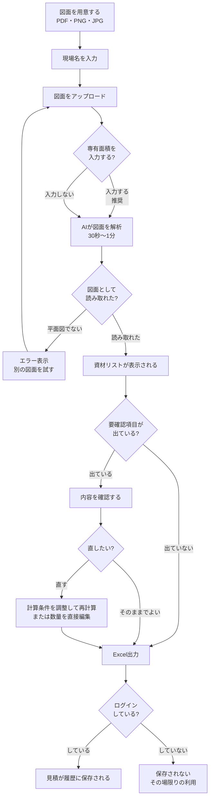

# ZAIRYO 資材拾いアシスタント ／ 製品仕様書

図面をアップロードすると、AIが読み取って資材の数量と概算金額を自動で算出します。
手作業で半日かかっていた資材拾いを、数分に短縮することを目的としたシステムです。

- **利用形態**: Webブラウザ（インストール不要・PC/タブレット対応）
- **対象図面**: 計画平面図・平面詳細図（PDF / PNG / JPG、10MBまで）
- **出力**: 資材リスト（画面表示・Excelダウンロード）

---

## 1. できること

| できること | 内容 |
|---|---|
| 図面の自動読み取り | 部屋の面積・間取り・天井高・建具・設備を図面から読み取ります |
| 資材数量の自動計算 | 石膏ボード、フローリング、クロス、巾木など**19分野・約130項目**を算出します |
| 概算金額の算出 | 登録済みの単価をかけ合わせ、合計金額の目安を表示します |
| 数量の手直し | AIの読み取りが不安なときは、画面上で数量や単価を直せます |
| 独自項目の追加 | 特注造作など、自動計算にない項目を見積に足せます |
| Excel出力 | 資材リストをExcelファイルでダウンロードできます |
| 過去の見積の保存 | ログインすると、現場ごとに見積を保存し、あとから見返せます |

### 算出できる資材の分野（19分野）

解体工事 / 仮設工事 / 左官工事 / 大工工事 / 下地材 / 床材 / 造作材 / 仕上材 /
建具 / 家具 / 設備 / 設備工事 / ガス工事 / 電気工事 / 電材 / サッシ工事 /
内装材 / 現場管理 / 諸経費

---

## 2. 使い方の流れ

### ステップ1：図面をアップロードする

1. 現場名を入力します（例：○○マンション101号室）
2. 図面ファイルをドラッグ＆ドロップ、またはクリックして選択します
3. **専有面積がわかる場合は入力します**（任意ですが、入力すると精度が上がります）
4. 「資材リストを計算」を押します

> **所要時間**: 図面の解析には30秒〜1分ほどかかります。画面に進行状況が表示されます。

### ステップ2：資材リストを確認する

計算が終わると、資材リストの画面に移ります。

**画面の上部に表示されるもの**
- 概算合計金額
- 壁面積・天井面積・居室床面積・水回り床面積
- **要確認項目（黄色い警告パネル）** … AIの読み取りに不安がある箇所を教えてくれます

**要確認項目とは**
図面の書き方によっては、AIが数値を読み違えることがあります。システムはそれを検知して自動で補正し、「何をどう直したか」を警告パネルに表示します。たとえば：

- 「間仕切壁の長さが実績より短いため、読み落としの可能性があります」
- 「外形寸法の読み取りが専有面積と矛盾したため、外形寸法の方を無視しました」

補正済みなのでそのまま使えますが、心配な項目は次のステップで直せます。

### ステップ3：必要なら手直しする

**計算条件の調整**（🔧ボタン）
- 間仕切壁の長さ（m）
- 天井高（mm）

この2つを入力し直して「再計算」すると、資材数量が計算し直されます。

**数量・単価の編集**（✏️ボタン）
- 表の中の数量・単価を直接書き換えられます
- 「＋行を追加」で、自動計算にない独自項目を足せます
- 手直しした行には「調整済」の印が付き、元の数量も記録されます

### ステップ4：Excelに出力する

「📥 Excel出力」を押すと、資材リストがExcelファイルとしてダウンロードされます。
カテゴリ・資材名・仕様・数量・単位・計算根拠が入った表になっています。

### ステップ5（任意）：過去の見積を見返す

ログインしている場合、見積は自動で保存されます。「履歴」から過去の現場を開き、内容の確認やExcelの再出力ができます。

---

## 3. 操作フロー図

---

## 4. ログインとゲスト利用

| | ゲスト（ログインなし） | ログイン（会社アカウント） |
|---|---|---|
| 図面のアップロード | ○ | ○ |
| 資材リストの計算 | ○ | ○ |
| Excel出力 | ○ | ○ |
| 見積の保存・履歴 | ✕（その場限り） | ○（会社ごとに保存） |
| 自社単価の登録 | ✕ | ○ |

- アカウントの発行には**招待コード**が必要です（運営者が発行します）
- 会社ごとにデータは完全に分離され、他社の見積は一切見えません
- パスワードを忘れた場合は運営者にご連絡ください（再発行できます）

---

## 5. 単価の設定

### 標準単価とカスタム単価

システムには**標準単価**があらかじめ登録されています。会社ごとに仕入れ値が違うため、「単価設定」画面で自社の単価に上書きできます。

- 上書きした資材だけが「カスタム」になり、それ以外は標準単価が使われます
- 「標準に戻す」でいつでも元に戻せます
- Excelで一括編集して読み込むこともできます
- 画面から独自の資材を追加登録することもできます

### 現在の制約

自動計算が出す約130項目のうち、標準単価が登録されているのは約40項目です。
残りの項目は数量は正しく出ますが、**単価が「-」と表示され、合計金額には含まれません**。
実勢価格のリストをいただければ登録できます。

---

## 6. 精度について

プロの手作業による拾い出しと比較して検証しています。

### 検証結果（マンション1タイプ・専有面積を入力しない条件）

| 項目 | 手作業の実績との差 |
|---|---|
| 専有面積 | 0%（一致） |
| 天井面積 | +2.2% |
| 天井石膏ボード | +4% |
| 際根太 | -1% |
| 遮音壁ボード | 0%（一致） |
| グラスウール | -3% |

### 精度を上げるコツ

1. **専有面積を入力する** — 最も効果があります。物件資料の値を入れてください
2. **寸法や面積が書かれた図面を使う** — 平面詳細図が最適です
3. **要確認項目に目を通す** — システムが「自信のない箇所」を教えてくれます

### 苦手なこと

面積が書かれていない区画（廊下・キッチン・水回りなど）は、AIが目測するため誤差が出ます。
特に**間仕切壁の長さ**は読み取りにばらつきが出やすく、同じ図面でも回によって値が変わることがあります。
この項目は要確認項目に表示されるので、実測値がわかる場合は手動で入力してください。

---

## 7. 安全性について

- 通信はすべて暗号化されています
- パスワードは暗号化して保存され、運営者にも見えません
- アップロードされた図面は外部から取得できない場所に保管されます
- ログインしていない状態でアップロードした図面と見積は、**24時間後に自動削除**されます
- 会社ごとにデータは分離され、他社のデータには一切アクセスできません

---

## 8. よくある質問

**Q. 最初のログインに時間がかかります**
A. しばらく使われていないとサーバーが休止するため、起動に最大1分ほどかかります。2回目以降は速くなります。画面に進行状況のバーが表示されます。

**Q. 平面図以外をアップロードするとどうなりますか**
A. 立面図や仕上表など、平面図でない画像はシステムが検知して「この画像は計画平面図ではありません」とエラーを返します。誤った見積が作られることはありません。

**Q. 金額が「-」になっている項目があります**
A. その資材の単価がまだ登録されていません（→ 5章）。数量は正しく計算されています。

**Q. 数量を直したら、元の数字はわからなくなりますか**
A. いいえ。手直しした行には「調整済」と表示され、Excelの計算根拠欄に「手動調整（元: ○○）」と記録されます。

**Q. 途中でブラウザを閉じてしまいました**
A. 同じタブで戻れば、直前の見積が復元されます。ログインしている場合は履歴からも開けます。

**Q. AIが図面を読めなかったらどうなりますか**
A. 読み取れない場合はエラーになり、架空の数値で見積が作られることはありません。図面の解像度を上げるか、寸法の入った図面をお試しください。

---

## 9. 動作環境

| 項目 | 内容 |
|---|---|
| 端末 | PC・タブレット（Windows / Mac / iPad） |
| ブラウザ | Chrome / Edge / Safari（最新版） |
| インストール | 不要（URLにアクセスするだけ） |
| 図面ファイル | PDF / PNG / JPG、1ファイル10MBまで |
| インターネット接続 | 必須 |
